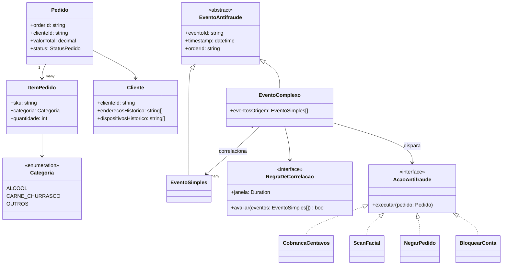
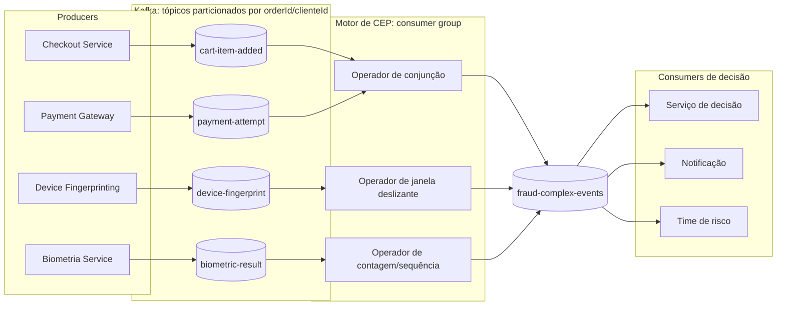
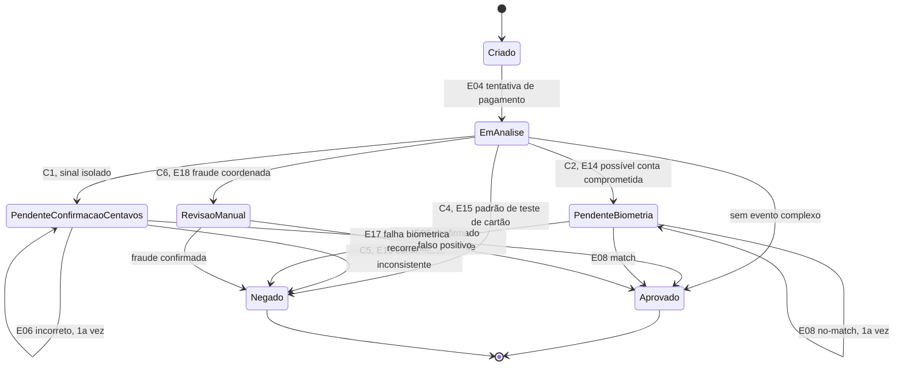
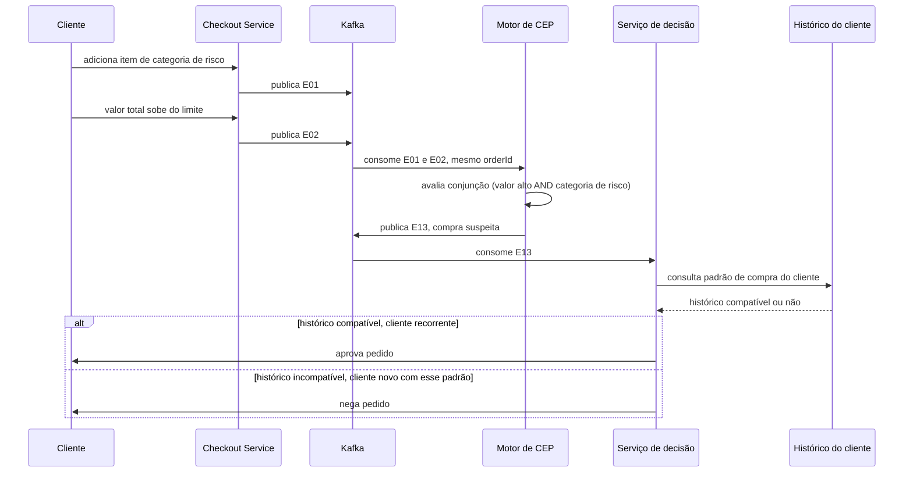
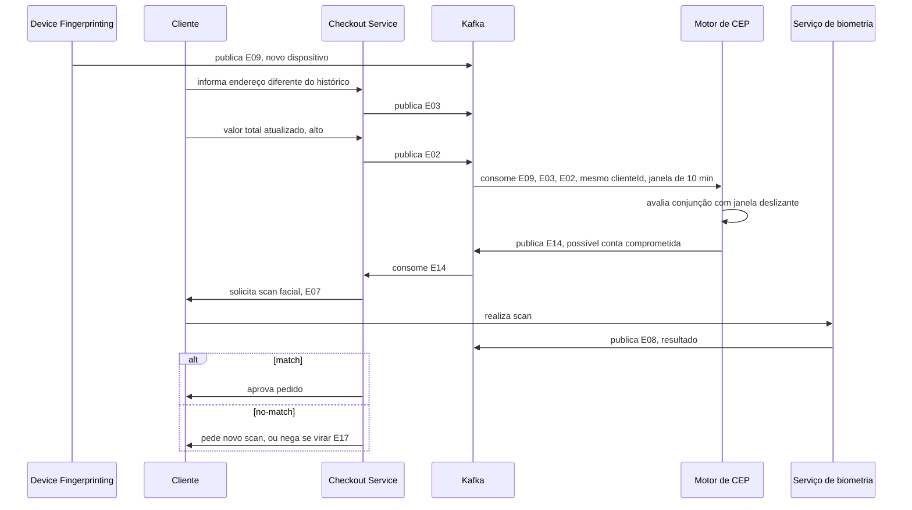
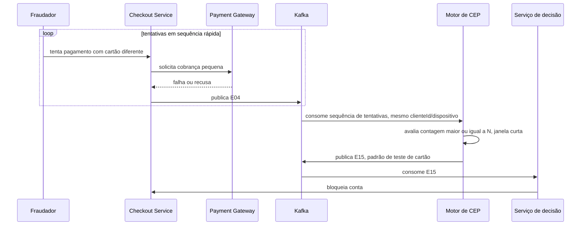

# Ponderada: Complex Event Processing (CEP)

## Software escolhido

Antifraude do checkout do site shopper.com.br

### Contexto

Shopper é um mercado online: cliente compra pelo site ou app, sem contato presencial no momento da compra. Por não existir verificação humana no caixa, o antifraude é o sistema que decide, durante o checkout, se o pedido segue direto, passa por verificação extra, ou é barrado, cruzando sinais do pedido (itens, valor, dispositivo, endereço) pra separar cliente legítimo de fraude sem travar a operação com falso positivo.

## Tabela de eventos

| ID | Evento | Descrição | Categoria | Tipo | Justificativa técnica |
|---|---|---|---|---|---|
| E01 | Item de categoria de risco adicionado ao carrinho | Cliente adiciona item de categoria álcool, carne ou churrasco | Simples | Negócio | Fato atômico do domínio, gerado direto pela ação do cliente, sem depender de correlação com outro evento |
| E02 | Valor total do pedido atualizado | Soma do carrinho muda a cada item adicionado ou removido | Simples | Negócio | Estado observável do pedido no instante da emissão, sem agregação sobre janela de tempo |
| E03 | Endereço de entrega diferente do histórico | Endereço do pedido não bate com os endereços recorrentes do cliente | Simples | Negócio | Comparação direta contra cadastro, sem janela temporal nem múltiplos eventos |
| E04 | Tentativa de pagamento | Cliente inicia a cobrança do pedido | Simples | Negócio | Marco único do fluxo de checkout |
| E05 | Cobrança de N centavos autorizada | Gateway autoriza microcobrança de verificação | Simples | Negócio | Resultado pontual de uma chamada ao gateway |
| E06 | Cliente confirma ou erra valor cobrado | Cliente informa o valor que acha que foi cobrado | Simples | Negócio | Entrada única do usuário, sem dependência de eventos anteriores da mesma categoria |
| E07 | Scan facial solicitado | Sistema pede verificação biométrica antes de concluir a compra | Simples | Negócio | Ação disparada, não correlação |
| E08 | Resultado do scan facial (match ou no-match) | Retorno da verificação biométrica | Simples | Negócio | Resultado atômico de uma única chamada ao serviço de biometria |
| E09 | Novo dispositivo detectado | Fingerprint do device diverge do histórico do cliente | Simples | Técnico | Produzido por componente de infraestrutura (device fingerprinting), não por ação de domínio, mas alimenta direto a correlação de [E14](#e14) |
| E10 | Timeout ou falha na integração com gateway de pagamento | Erro de rede/infra na chamada ao gateway | Simples | Técnico | Evento de sistema que afeta se a cobrança de [E05](#e05) chega a acontecer, tem consequência direta no fluxo de negócio |
| E11 | Falha na chamada ao serviço de biometria | Serviço de scan facial fica indisponível ou retorna erro | Simples | Técnico | Sem esse sinal, [E08](#e08) não pode ser emitido, o sistema precisa cair num fluxo alternativo (ex: repetir cobrança de centavos) em vez de travar o checkout |
| E12 | Latência alta na chamada ao serviço de device fingerprinting | [E09](#e09) demora além do aceitável pra chegar | Simples | Técnico | Se o sinal de dispositivo não chega dentro da janela de correlação de [E14](#e14), o sistema decide sem esse sinal, o que muda o resultado da avaliação de risco |
| E13 | Compra suspeita | Valor do pedido acima do limite e item de categoria de risco no mesmo pedido | Complexo | Negócio | Conjunção (AND) de [E01](#e01) e [E02](#e02) escopada ao mesmo `orderId`, não existe sem correlacionar os dois |
| E14 | Possível conta comprometida | [E09](#e09), [E03](#e03) e valor alto dentro de uma janela curta (ex: 10 min) | Complexo | Negócio | Conjunção com janela deslizante sobre 3 eventos de origens distintas, a coincidência na janela é o que importa, não a ordem |
| E15 | Padrão de teste de cartão | Múltiplas tentativas de [E04](#e04) falhando ou trocando de cartão em curto intervalo | Complexo | Negócio | Sequência com contagem (threshold sobre repetição do mesmo tipo de evento na mesma sessão) |
| E16 | Confirmação inconsistente | 2 ou mais ocorrências de [E06](#e06) com erro, na mesma sessão | Complexo | Negócio | Contagem com escopo de sessão, evento simples repetido vira gatilho só ao ultrapassar o threshold |
| E17 | Falha biométrica recorrente | 2 ou mais ocorrências de [E08](#e08) com no-match, na mesma sessão | Complexo | Negócio | Mesmo mecanismo de [E16](#e16), aplicado a outro evento simples de origem |
| E18 | Dispositivo ou endereço compartilhado entre múltiplas contas | Mesmo fingerprint ou endereço aparece em pedidos de contas de cliente diferentes numa janela curta | Complexo | Negócio | Correlação cross-entity: não é escopada a um único `orderId`/cliente, mas a um recurso compartilhado entre streams de clientes distintos, padrão típico de detecção de fraude em anel |

12 eventos simples (8 negócio, 4 técnico) e 6 complexos (todos negócio, por serem decisões derivadas).

## Cenários de negócio

| ID | Cenário | Evento(s) de entrada | Ação disparada | Ganho de eficiência |
|---|---|---|---|---|
| C1 | Cobrança de centavos em vez de bloqueio direto | 1 sinal de risco isolado (ex: [E03](#e03), sem outros sinais na janela) | [E05](#e05) | Evita negar venda legítima por 1 sinal fraco, resolve a ambiguidade com fricção mínima |
| C2 | Scan facial só com correlação multi-sinal | [E14](#e14) | [E07](#e07) | Biometria só é exigida quando 3 sinais convergem, reduz atrito no checkout da maioria dos pedidos, que não geram [E14](#e14) |
| C3 | Negação de combo suspeito com exceção por histórico do próprio cliente | [E13](#e13) correlacionado com histórico de compra do mesmo cliente | Negar pedido, ou liberar se o padrão já é recorrente pra esse cliente | Reduz falso positivo em cliente recorrente (ex: churrasco de família), mantendo o bloqueio pra cliente novo com o mesmo padrão |
| C4 | Bloqueio preventivo por teste de cartão | [E15](#e15) | Bloquear conta | Detecção em tempo real corta a fraude na 3ª/4ª tentativa, antes do cartão testado ser usado numa compra de valor alto |
| C5 | Escalonamento progressivo por confirmação inconsistente | [E06](#e06) repetido, virando [E16](#e16) | 1º erro: pedir nova confirmação. 2º erro ([E16](#e16)): negar ou exigir [E07](#e07) | Erro isolado de digitação não penaliza cliente legítimo, só o padrão repetido eleva a ação |
| C6 | Detecção de fraude coordenada entre contas | [E18](#e18) | Flag das contas envolvidas pra revisão, ou bloqueio em lote | Correlação entre clientes diferentes (não só dentro de 1 pedido) pega fraude organizada que nenhuma regra por pedido isolado detectaria |

## Diagramas UML

Seis diagramas cobrem os fluxos: dois estáticos (estrutura e arquitetura), um dinâmico de ciclo de vida, e três dinâmicos de sequência, um por mecanismo de correlação distinto da tabela de eventos.

### 1. Diagrama de classes: estrutura de domínio

Modela as entidades do pedido e a hierarquia de eventos: evento simples e complexo herdam de uma classe abstrata comum, o evento complexo agrega os eventos simples que correlaciona através de uma regra, e dispara uma ação que implementa uma interface comum.

### 2. Diagrama de componentes: arquitetura de streaming

Cada serviço de origem é um producer que publica num tópico Kafka próprio por tipo de evento. Os tópicos são particionados por `orderId` (ou `clienteId`, pros eventos que correlacionam entre pedidos como [E18](#e18)), garantindo que os eventos do mesmo pedido cheguem em ordem ao mesmo consumer, requisito pra correlação de janela funcionar. O motor de CEP é um consumer group que aplica os operadores (conjunção, janela deslizante, contagem) e publica o evento complexo resultante num tópico de saída, consumido pelos serviços de decisão.

### 3. Diagrama de estados: ciclo de vida do pedido

Representa como o pedido transita entre estados conforme os eventos (simples e complexos) chegam. Cobre os seis cenários de negócio de forma genérica, já que todos resultam numa dessas transições.

### 4. Diagrama de sequência: combo suspeito até decisão por histórico (cenário C3)

Mostra como dois eventos simples do mesmo pedido são correlacionados pelo motor de CEP em [E13](#e13), e como a decisão final consulta o histórico do cliente antes de agir, evitando negar um cliente recorrente.

### 5. Diagrama de sequência: correlação multi-sinal até scan facial (cenário C2)

Mostra três eventos simples de origens diferentes (dispositivo, endereço, valor) sendo correlacionados numa janela deslizante, resultando em [E14](#e14) e na exigência de biometria antes de aprovar o pedido.

### 6. Diagrama de sequência: padrão de teste de cartão até bloqueio (cenário C4)

Mostra uma sequência de tentativas de pagamento pequenas e rápidas sendo contadas pelo motor de CEP até ultrapassar o limite, gerando [E15](#e15) e o bloqueio preventivo da conta.

