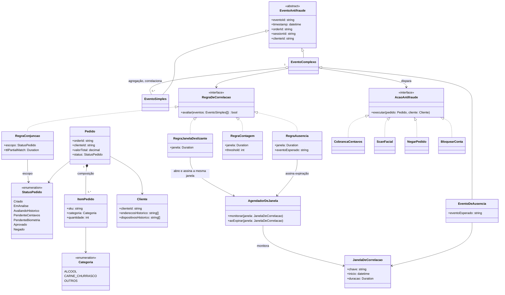
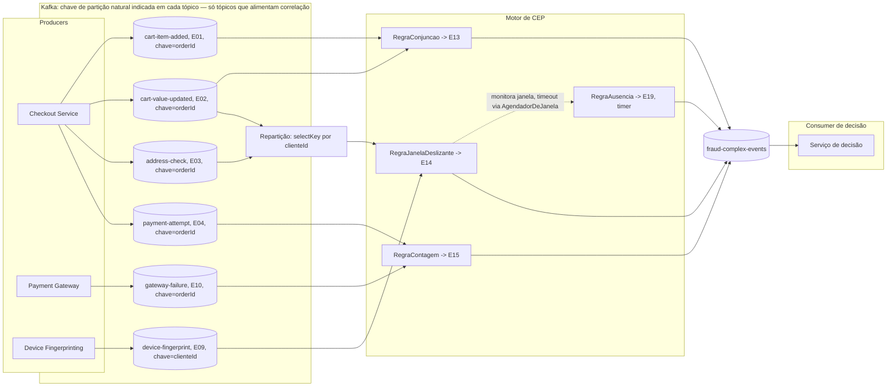
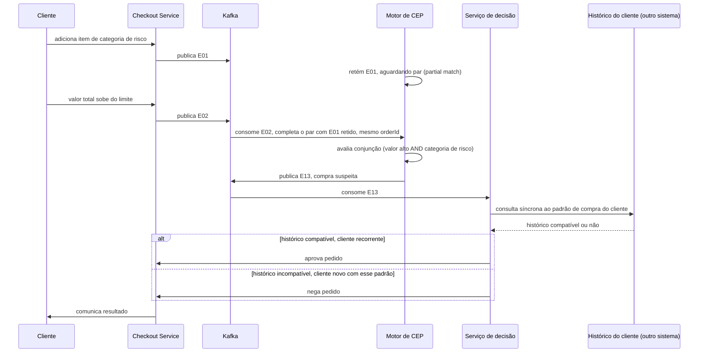
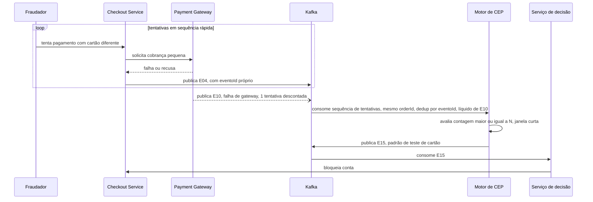

# Ponderada: Complex Event Processing (CEP)

## Software escolhido

Antifraude do checkout do site shopper.com.br

### Contexto

Shopper é um mercado online: cliente compra pelo site ou app, sem contato presencial no momento da compra. Por não existir verificação humana no caixa, o antifraude é o sistema que decide, durante o checkout, se o pedido segue direto, passa por verificação extra, ou é barrado, cruzando sinais do pedido (itens, valor, dispositivo, endereço) pra separar cliente legítimo de fraude sem travar a operação com falso positivo.

NSU (identificador de transação de adquirente/maquininha) não se aplica aqui: é campo de pagamento presencial via adquirente, e o domínio escolhido é checkout de e-commerce sem esse componente. Fora de escopo por natureza do domínio, não por omissão.

### Conceito de CEP que entendi com base nos autoestudos

Entendimento: eventos simples A e B acontecem, o motor de CEP os processa em tempo real e, ao encontrar um padrão entre eles, gera um evento complexo C, derivado dos dois primeiros. Isso dá ao sistema o poder de reagir à fraude "ao vivo", durante o checkout, em vez de descobrir o problema depois, numa análise em lote no fim do dia.

Aplicando ao meu exemplo: [E01](#e01) (item de risco) e [E02](#e02) (valor atualizado) são o A e o B. O motor de CEP aplica uma regra de conjunção sobre os dois, escopados ao mesmo pedido, enquanto o pedido está em `Criado`, e gera [E13](#e13) (compra suspeita), que é o C. A reação (pedir verificação extra ou negar) acontece enquanto o pedido ainda está aberto, porque o processamento é sobre o stream, não sobre um relatório do dia seguinte.

#### Critério de classificação usado na tabela de eventos

| Classificação | Definição | Teste de inclusão |
|---|---|---|
| Simples | Fato atômico, observado direto na fonte | Existe sozinho, sem precisar correlacionar com nenhum outro evento |
| Complexo | Evento derivado | Só existe como resultado de aplicar um operador de correlação (conjunção, janela deslizante, contagem/sequência, ausência) sobre 2 ou mais eventos simples, ou sobre a falta de um deles |
| Negócio | Representa um fato do processo de compra/pagamento | Relevante pro domínio em si, independente de qual tecnologia processa ele |
| Técnico | Se origina de um componente de infraestrutura/plataforma (fingerprinting, gateway, broker) | Só entra na modelagem se alimentar uma decisão do motor de fraude, virando input de um evento complexo ou mudando uma ação do sistema. Evento técnico que não afeta nenhuma decisão de negócio (ex: métrica genérica de saúde do broker) fica fora do escopo, é operação da plataforma Kafka, não evento do domínio de antifraude |

## 1. Tabela de eventos

Os 13 eventos abaixo foram levantados a partir do fluxo de checkout descrito no contexto e classificados segundo o critério acima. Os IDs 05, 11, 12, 16, 17, 18 e 20/21 foram cortados nesta versão por duplicarem mecanismo já demonstrado por outro evento, não terem cenário de negócio próprio, ou não terem nenhuma representação nos diagramas dinâmicos — numeração não é sequencial de propósito. Todo evento carrega `orderId` e `sessionId` (ver diagrama 1), as correlações usam a chave que faz sentido pro caso: `orderId` pra eventos do mesmo pedido, `sessionId` pra eventos que podem repetir antes do pedido fechar (confirmação, biometria), `clienteId` pra correlação entre pedidos do mesmo cliente.

| ID | Evento | Descrição | Categoria | Tipo | Justificativa técnica |
|---|---|---|---|---|---|
| E01 | Item de categoria de risco adicionado ao carrinho | Cliente adiciona item de categoria álcool, carne ou churrasco | Simples | Negócio | Fato atômico do domínio, gerado direto pela ação do cliente, sem depender de correlação com outro evento |
| E02 | Valor total do pedido atualizado | Soma do carrinho muda a cada item adicionado ou removido | Simples | Negócio | Estado observável do pedido no instante da emissão, sem agregação sobre janela de tempo |
| E03 | Endereço de entrega diferente do histórico | Endereço do pedido não bate com os endereços recorrentes do cliente | Simples | Negócio | Comparação direta contra cadastro, sem janela temporal nem múltiplos eventos |
| E04 | Tentativa de pagamento | Cliente inicia a cobrança do pedido | Simples | Negócio | Marco único do fluxo de checkout |
| E06 | Cliente confirma ou erra valor cobrado | Cliente informa o valor que acha que foi cobrado | Simples | Negócio | Entrada única do usuário, sem dependência de eventos anteriores da mesma categoria |
| E07 | Scan facial solicitado | Sistema pede verificação biométrica antes de concluir a compra | Simples | Negócio | Ação disparada, não correlação |
| E08 | Resultado do scan facial (match ou no-match) | Retorno da verificação biométrica | Simples | Negócio | Resultado atômico de uma única chamada ao serviço de biometria |
| E09 | Novo dispositivo detectado | Fingerprint do device diverge do histórico do cliente | Simples | Técnico | Produzido por componente de infraestrutura (device fingerprinting), não por ação de domínio, mas alimenta direto a correlação de [E14](#e14) |
| E10 | Timeout ou falha na integração com gateway de pagamento | Erro de rede/infra na chamada ao gateway | Simples | Técnico | Usado pelo processador de [E15](#e15) pra excluir a tentativa do contador de fraude: falha do gateway não é a mesma coisa que fraudador testando cartão, sem essa exclusão o contador gera falso positivo |
| E13 | Compra suspeita | Valor do pedido acima do limite e item de categoria de risco no mesmo pedido, enquanto o pedido está em `Criado`, antes da tentativa de pagamento (`E04`) — nunca em `EmAnalise`, que só existe depois de `E04` (ver diagrama 3) | Complexo | Negócio | Conjunção (AND) de [E01](#e01) e [E02](#e02) escopada ao mesmo `orderId`. O que faz isso ser correlação de CEP e não um `if` disfarçado: [E01](#e01) e [E02](#e02) são publicados por partes distintas do checkout e não chegam em ordem garantida, o motor mantém um "partial match" (retém o primeiro evento até o par completar), igual pattern matching de motores CEP tipo Esper. Esse partial match tem TTL igual ao timeout de carrinho abandonado da loja: se o pedido nunca sai de `Criado` dentro desse prazo, o estado retido expira e é descartado, evitando acúmulo indefinido no state store |
| E14 | Possível conta comprometida | [E09](#e09), [E03](#e03) e valor alto ([E02](#e02)) dentro de uma janela curta (ex: 10 min), mesmo `clienteId` | Complexo | Negócio | Conjunção com janela deslizante sobre 3 eventos de origens distintas, a coincidência na janela é o que importa, não a ordem. [E03](#e03) e [E02](#e02) nascem chaveados por `orderId`, precisam de repartição pra `clienteId` antes do join (detalhe no diagrama 2), já que o mesmo cliente pode ter feito o pedido em sessões diferentes |
| E15 | Padrão de teste de cartão | Múltiplas tentativas de [E04](#e04) falhando dentro do mesmo `orderId`, antes do pedido fechar, líquido de exclusões de [E10](#e10) | Complexo | Negócio | Contagem com threshold sobre repetição do mesmo tipo de evento, escopada ao mesmo pedido (mesma chave de [E04](#e04)/[E10](#e10), sem repartição necessária, ao contrário de [E14](#e14)) |
| E19 | Decisão tomada sem sinal de dispositivo | Janela de correlação de [E14](#e14) expira sem [E09](#e09) chegar, qualquer que seja o motivo (latência, falha ou serviço fora do ar) | Complexo | Negócio | Padrão de ausência de verdade: nasce só da expiração do `AgendadorDeJanela` monitorando a janela (ver diagrama 1), não depende de nenhum sinal do serviço de origem. Se o Device Fingerprinting travar de vez e não emitir nada, o timer expira do mesmo jeito e [E19](#e19) dispara, é isso que diferencia ausência real de "reação a um evento de erro" |

### Cobertura das 4 combinações simples/complexo × técnico/negócio

Das 4 combinações possíveis entre as duas dimensões da tabela acima, a modelagem cobre 3: simples-negócio ([E01](#e01)-[E08](#e08), exceto E09/E10), simples-técnico ([E09](#e09), [E10](#e10)), complexo-negócio ([E13](#e13), [E14](#e14), [E15](#e15), [E19](#e19)). Não existe complexo-técnico nesta versão, de propósito: os únicos eventos técnicos do domínio ([E09](#e09), [E10](#e10)) entram como **insumo** de correlação, nunca como **saída** dela — o motor de CEP aqui só produz evento complexo pra alimentar decisão de negócio (compra suspeita, conta comprometida, teste de cartão), nunca uma decisão de infraestrutura. Um evento complexo-técnico existiria, por exemplo, se o motor correlacionasse repetições de [E10](#e10) entre pedidos distintos na mesma janela pra gerar um alerta de instabilidade do gateway — isso é operação de plataforma (SRE/observabilidade), não decisão de antifraude, por isso fica fora do escopo do domínio escolhido (ver critério de tipo técnico na tabela acima: só entra se alimentar decisão de negócio).

## 2. Modelagem estática e dinâmica (UML)

Seis diagramas cobrem os fluxos: dois estáticos (estrutura e arquitetura) e quatro dinâmicos (ciclo de vida do pedido e três sequências, uma por mecanismo de correlação distinto da tabela de eventos).

### 2.1 Modelagem estática

#### Diagrama 1: diagrama de classes, estrutura de domínio

Modela as entidades do pedido e a hierarquia de eventos. `EventoComplexo` tem duas formas: a comum, que agrega os eventos simples presentes que correlacionou (via a associação de agregação com `EventoSimples`, cardinalidade `0..*` cobrindo o caso vazio), e `EventoDeAusencia` (caso de [E19](#e19)), que nasce da falta de um evento esperado dentro de uma `JanelaDeCorrelacao`, monitorada por um `AgendadorDeJanela` que dispara a avaliação quando a janela expira sem o sinal chegar. `RegraDeCorrelacao` não carrega mais `janela: Duration` genérico na interface, porque nem toda implementação usa duração (`RegraConjuncao`, de [E13](#e13), é escopada por estado do pedido, não por tempo), cada implementação concreta declara o atributo que faz sentido pra ela.

`RegraConjuncao` implementa [E13](#e13), `RegraJanelaDeslizante` implementa [E14](#e14), `RegraContagem` implementa [E15](#e15), `RegraAusencia` implementa [E19](#e19) e é a única que produz um `EventoDeAusencia` em vez de um `EventoComplexo` comum, disparada só pelo `AgendadorDeJanela`, sem depender de nenhum evento simples de origem. `avaliar(eventos)` é chamado por ela com lista vazia, no callback de `aoExpirar`, a assinatura genérica da interface cobre esse caso sem precisar de método próprio. `RegraJanelaDeslizante` e `RegraAusencia` assinam o **mesmo** `AgendadorDeJanela`/`JanelaDeCorrelacao` (ver diagrama 5): a janela é aberta uma única vez esperando [E09](#e09), e o resultado bifurca conforme o sinal chega ([E14](#e14)) ou a janela expira antes ([E19](#e19)) — não são dois mecanismos de janela independentes.

`StatusPedido` é modelado como enum explícito porque é usado por dois lugares (`Pedido.status` e o escopo de `RegraConjuncao`), igual `Categoria`: os valores batem 1:1 com os estados do diagrama 3. `Cliente` não carrega mais um `status` próprio: nenhum diagrama dinâmico movimenta esse campo, `BloquearConta` (cenário [C4](#c4)) já é a ação concreta que cobre o bloqueio, sem precisar de um enum de estado do cliente que nunca é lido nem escrito em nenhuma sequência.

#### Diagrama 2: diagrama de arquitetura de streaming

Este é um diagrama de arquitetura/fluxo (não um diagrama de componentes UML formal, sem estereótipo `<<component>>` nem notação de interface lollipop/socket), a escolha aqui é mostrar o roteamento real de tópico por evento, que é o que a tabela 1 precisa provar que sustenta. Ele é complementar, não a base da exigência de modelagem estática UML: essa exigência já é cumprida pelo diagrama 1 (diagrama de classes, UML formal). Isso deixa a modelagem estática deste documento com 1 diagrama UML formal + 1 diagrama de arquitetura não-UML, contra 4 diagramas dinâmicos, todos UML formal (diagramas 3, 4, 5 e 6). Só entram aqui os tópicos que alimentam alguma correlação de CEP ([E01](#e01), [E02](#e02), [E03](#e03), [E04](#e04), [E09](#e09), [E10](#e10)) — [E06](#e06) e [E08](#e08) são eventos simples de negócio já cobertos pela tabela 1, mas não participam de nenhuma `RegraDeCorrelacao`, então não têm papel a provar neste diagrama.

Cada serviço de origem é um producer que publica num tópico Kafka próprio por tipo de evento, com a chave de partição natural indicada em cada tópico. [E14](#e14) correlaciona por `clienteId`, mas `cart-value-updated` e `address-check` nascem chaveados por `orderId` (um cliente pode ter feito o pedido em sessões diferentes), então passam por `RK1` (repartição via `selectKey`) antes de chegar no processador.

[E15](#e15) correlaciona dentro do **mesmo `orderId`** (múltiplas tentativas de pagamento no mesmo pedido antes dele fechar), que já é a chave natural de `payment-attempt`/`gateway-failure`, então não precisa de repartição nenhuma.

[E19](#e19) não consome nenhum tópico: ele é puramente o timeout do `AgendadorDeJanela` que monitora a janela aberta por `P14` (ver diagrama 1). Isso é o que garante que E19 seja ausência de verdade, dispara mesmo se o Device Fingerprinting cair de vez e não publicar nada, não uma reação a um evento de erro específico.

### 2.2 Modelagem dinâmica

#### Diagrama 3: diagrama de estados, ciclo de vida do pedido

Representa como o pedido transita entre estados. Todos os rótulos de transição abaixo são eventos ou triggers nomeados, não números de cenário (o mapeamento pra cenário de negócio fica só no texto, não no diagrama, pra não misturar os dois vocabulários). `E13`, `E14` e `E19` saem de `Criado`, não de `EmAnalise`: as sequências 4 e 5 mostram os três sendo avaliados enquanto o cliente ainda monta o carrinho, antes de qualquer tentativa de pagamento — colocar a transição em `EmAnalise` implicaria que só reagem depois de `E04`, o que contradiria as próprias sequências. `E13` leva a `AvaliandoHistorico` e corresponde ao [C3](#c3) (diagrama 4 detalha essa consulta), `E14`/`E19` correspondem ao [C2](#c2). O caminho de sinal isolado sem nenhuma correlação disparada (fallback padrão pra `PendenteCentavos`) existe no sistema mas fica fora deste diagrama, de propósito: não é produzido por nenhuma `RegraDeCorrelacao`, então não é um evento de CEP nem cenário numerado (ver seção 3), e modelar aqui só inflaria o diagrama sem provar nenhum dos 3 critérios da ponderada. `E15` só pode ocorrer depois de `EmAnalise`, porque depende de repetidas tentativas de `E04`, e corresponde ao [C4](#c4). A transição rotulada `E15, BloquearConta` deixa explícito que quem move o pedido pra `Negado` aqui é a execução de `BloquearConta` (não `NegarPedido` — são classes `AcaoAntifraude` distintas no diagrama 1): bloquear a conta do cliente também nega o pedido em aberto que originou a contagem, mas o cliente em si não ganha um status próprio no modelo estático, só o pedido é afetado. Nem confirmação de centavos errada nem biometria reprovada viram evento complexo ou bloqueio automático nesta versão (simplificação deliberada, nenhum cenário exige essa escalada): erro de confirmação é tratado como regra de negócio simples fora do escopo de CEP, e biometria reprovada cai no mesmo fallback de `PendenteCentavos`. Repetições que não mudam de estado ficam de fora do diagrama.

#### Diagrama 4: diagrama de sequência, combo suspeito até decisão por histórico (cenário C3)

Mostra como dois eventos simples do mesmo pedido são correlacionados pelo motor de CEP em [E13](#e13) via partial match (o processador retém o primeiro evento que chegar até o par completar), e como a decisão final consulta o histórico do cliente antes de agir, evitando negar um cliente recorrente. O histórico de compra consultado aqui vive no sistema de gestão de pedidos, fora da arquitetura de streaming do antifraude, é uma consulta síncrona a outro bounded context, não parte do pipeline de CQRS descrito na seção 2.3.

#### Diagrama 5: diagrama de sequência, correlação multi-sinal, ausência de sinal e scan facial (cenário C2)

Mostra três eventos simples de origens diferentes (dispositivo, endereço, valor) sendo correlacionados numa janela deslizante, resultando em [E14](#e14). Inclui o caminho alternativo em que o dispositivo não responde a tempo: o `AgendadorDeJanela` detecta a expiração por conta própria, sem depender de nenhum sinal do Device Fingerprinting, e o motor gera [E19](#e19) (ausência de sinal) em vez de travar esperando, seguindo pro mesmo fallback conservador.

#### Diagrama 6: diagrama de sequência, padrão de teste de cartão até bloqueio (cenário C4)

Mostra uma sequência de tentativas de pagamento pequenas e rápidas sendo contadas pelo motor de CEP até ultrapassar o limite, gerando [E15](#e15) e o bloqueio preventivo da conta. Uma falha de gateway ([E10](#e10)) no meio da sequência é descontada da contagem. Cada tentativa carrega um `eventoId` idempotente: Kafka garante entrega at-least-once por padrão, então se o producer reenviar a mesma tentativa, o processador de contagem reconhece o `eventoId` repetido e não conta duas vezes — pelo mesmo motivo, um atraso de rede que chega depois do grace period da janela de [E14](#e14) (diagrama 5) cai no caminho de [E19](#e19): ausência, não erro.

### 2.3 Event Sourcing e CQRS aplicados à arquitetura

**Event Sourcing, com a ressalva certa**: os tópicos de evento (`cart-item-added`, `device-fingerprint`, `fraud-complex-events` etc) são um log append-only, útil pra auditoria (reconstruir "o que aconteceu com esse pedido" replayando o stream daquele `orderId`). Isso não é Event Sourcing pleno enquanto `Pedido.status` (diagrama 1) continua sendo um campo mutável escrito diretamente pelos serviços de decisão: Event Sourcing de verdade exigiria que `status` fosse uma projeção, recalculada aplicando uma função de fold sobre o log de eventos daquele `orderId`, nunca escrita direto. Com a arquitetura atual, o que existe é log de auditoria com potencial de virar Event Sourcing pleno, não é a mesma coisa, e o documento não afirma mais que é.

**CQRS, com escopo honesto**: o lado de escrita é a ingestão via Kafka e os processadores de correlação (`P13`, `P14`, `P15`, `P19`), otimizado pra throughput, nunca consultado diretamente pelo Checkout. O lado de leitura é o consumer de decisão (`Serviço de decisão`, diagrama 2), que reage ao mesmo stream sem escrever nele. Esta versão do documento não materializa um read model dedicado (um índice cross-entity chegou a ser modelado numa revisão anterior e foi cortado por não ter cenário de negócio próprio), então o que sustenta CQRS aqui é a separação escrita/leitura em si, não uma estrutura de dados própria. O "histórico de compra do cliente" (diagrama 4) não conta como exemplo: vive no sistema de gestão de pedidos e é consultado de forma síncrona, integração externa, não o lado de leitura deste pipeline.

## 3. Cenários de negócio

#### Critério usado pra definir um cenário

| Critério | O que exige |
|---|---|
| Ancorado num evento real da tabela 1 | O evento de entrada é um ID específico ([E01](#e01) a [E19](#e19)) ou a ausência explícita de um evento complexo, nunca uma situação hipotética solta |
| Ação mapeada numa classe concreta | A ação disparada corresponde a uma das implementações de `AcaoAntifraude` do diagrama 1 (`CobrancaCentavos`, `ScanFacial`, `NegarPedido`, `BloquearConta`), não uma descrição vaga nova |
| Ganho sobre a transação, não sobre detecção em geral | O benefício declarado precisa ser sobre a transação em si (menos fricção, decisão mais rápida, bloqueio antes da perda), e não um argumento genérico de "detecta mais fraude" |
| Mecanismo de correlação real por trás | O evento de entrada é gerado por uma `RegraDeCorrelacao` de verdade (ou pela ausência de qualquer uma), não uma validação simples disfarçada de CEP |

[E19](#e19) tem reação de sistema definida (diagrama 3), mas não virou um dos 3 cenários abaixo — a ponderada pede 3 no mínimo, e os 3 já passam por `RegraJanelaDeslizante` ([C2](#c2)), `RegraConjuncao` ([C3](#c3)) e `RegraContagem` ([C4](#c4)), sem repetir tipo de regra. O caminho de sinal isolado sem correlação (fallback padrão pra `CobrancaCentavos`) continua existindo no sistema, mas não virou cenário numerado nem entrou no diagrama 3: não é implementado por nenhuma `RegraDeCorrelacao`, então não atende o critério "mecanismo de correlação real por trás" da tabela acima.

| ID | Cenário | Evento(s) de entrada | Ação disparada | Ganho de eficiência |
|---|---|---|---|---|
| C2 | Scan facial só com correlação multi-sinal | [E14](#e14) ou [E19](#e19) | `ScanFacial` (resultado: [E07](#e07)) | Biometria só é exigida quando os sinais convergem (ou o sinal de dispositivo está ausente), reduz atrito no checkout da maioria dos pedidos, que não geram nenhum dos dois |
| C3 | Negação de combo suspeito com exceção por histórico do próprio cliente | [E13](#e13) correlacionado com histórico de compra do mesmo cliente | `NegarPedido` no ramo incompatível; no ramo compatível não há `AcaoAntifraude` nenhuma, é o fluxo padrão de aprovação (ver nota) | Reduz falso positivo em cliente recorrente (ex: churrasco de família), mantendo o bloqueio pra cliente novo com o mesmo padrão |
| C4 | Bloqueio preventivo por teste de cartão | [E15](#e15) | Bloquear conta | Detecção em tempo real corta a fraude na 3ª/4ª tentativa, antes do cartão testado ser usado numa compra de valor alto |

## 4. Limitações conhecidas fora do escopo dos 3 critérios

Os itens abaixo não são cobrados pelos 3 critérios da ponderada nem mudam nenhum evento/diagrama/cenário acima — ficam registrados pra deixar claro que são simplificação deliberada, não lacuna não percebida:

- **Sem schema registry nem versionamento de evento**: os tópicos Kafka do diagrama 2 assumem payload estável. Em produção, mudar o formato de um evento (ex: adicionar campo em `E02`) sem contrato versionado quebra consumer antigo silenciosamente.
- **Sem dead-letter topic**: evento malformado ou que falha repetido na deserialização não tem rota de escape modelada; na prática pararia o processador de correlação daquele tópico.
- **TTL de partial match (`E13`) não é a mesma coisa que watermark**: o motor real de CEP (Esper, Flink CEP) trata evento fora de ordem via watermark explícito sobre o tempo de evento; aqui o TTL amarrado ao timeout de carrinho abandonado resolve o caso de uso, mas é um mecanismo mais simples, não um watermark de propósito geral.
- **`device-fingerprint` (E09) chaveado por `clienteId`** pressupõe cliente já identificado no momento da captura do fingerprint. Fluxo real de fraude costuma capturar esse sinal por sessão/dispositivo anônimo e correlacionar com `clienteId` só depois do login — o diagrama 2 simplifica isso pra não introduzir mais uma etapa de repartição.

Nota sobre [C3](#c3): dos 3 cenários, é o único onde nem toda ação do fluxo mapeia numa classe `AcaoAntifraude` — aprovar não é uma ação de antifraude no diagrama 1, é ausência de ação (o pedido segue seu curso normal sem intervenção do motor). O critério "ação mapeada numa classe concreta" da tabela acima vale só pra ação de fraude disparada, não pro caminho de aprovação, que por definição não precisa de uma classe própria.
