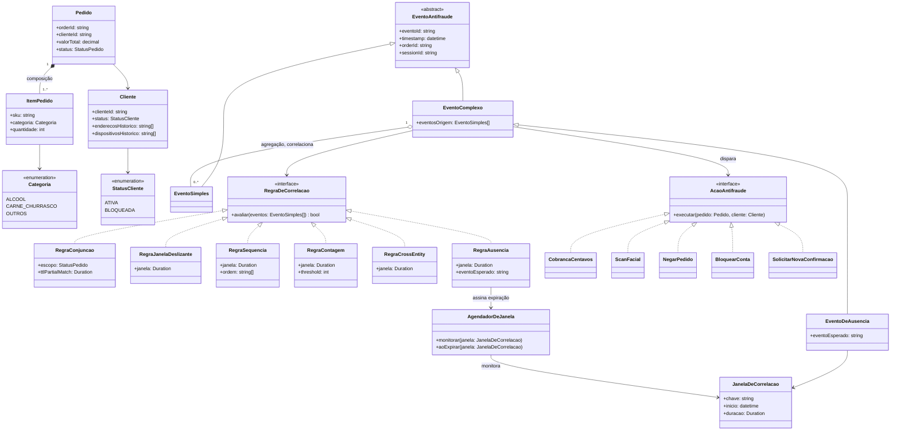
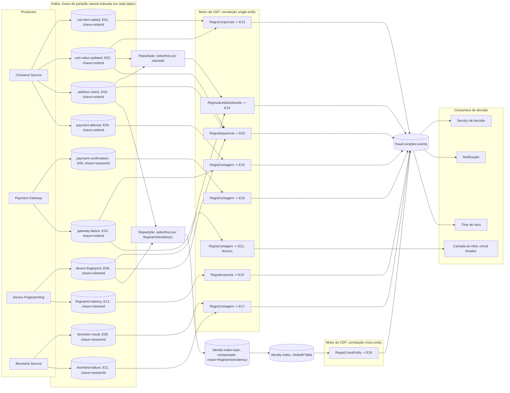
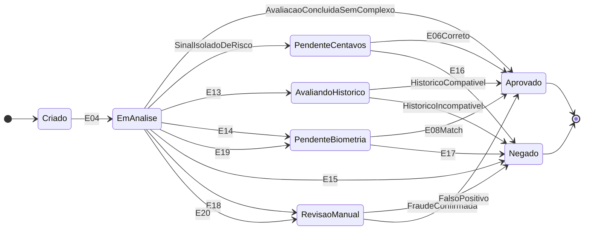
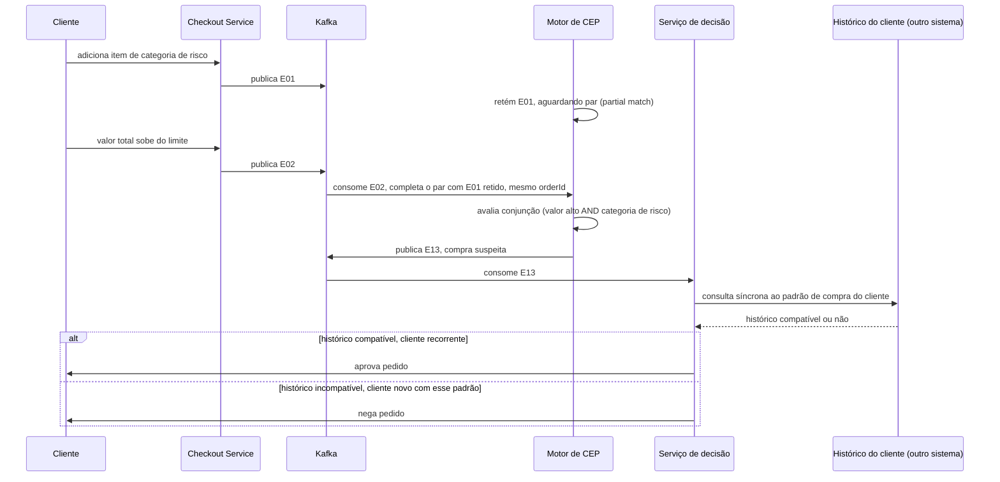
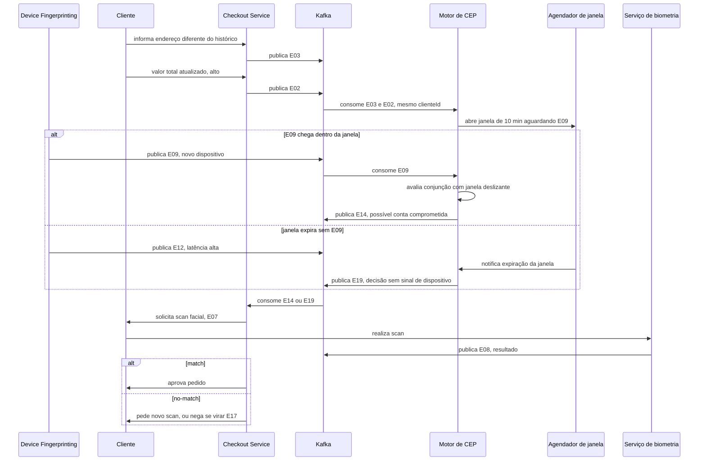
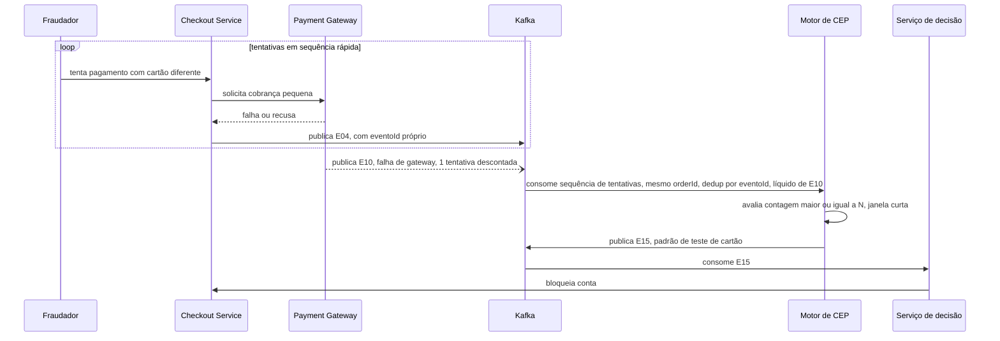

# Ponderada: Complex Event Processing (CEP)

## Software escolhido

Antifraude do checkout do site shopper.com.br

### Contexto

Shopper é um mercado online: cliente compra pelo site ou app, sem contato presencial no momento da compra. Por não existir verificação humana no caixa, o antifraude é o sistema que decide, durante o checkout, se o pedido segue direto, passa por verificação extra, ou é barrado, cruzando sinais do pedido (itens, valor, dispositivo, endereço) pra separar cliente legítimo de fraude sem travar a operação com falso positivo.

NSU (identificador de transação de adquirente/maquininha) não se aplica aqui: é campo de pagamento presencial via adquirente, e o domínio escolhido é checkout de e-commerce sem esse componente. Fora de escopo por natureza do domínio, não por omissão.

### Conceito de CEP que entendi com base nos autoestudos

Entendimento: eventos simples A e B acontecem, o motor de CEP os processa em tempo real e, ao encontrar um padrão entre eles, gera um evento complexo C, derivado dos dois primeiros. Isso dá ao sistema o poder de reagir à fraude "ao vivo", durante o checkout, em vez de descobrir o problema depois, numa análise em lote no fim do dia.

Aplicando ao meu exemplo: [E01](#e01) (item de risco) e [E02](#e02) (valor atualizado) são o A e o B. O motor de CEP aplica uma regra de conjunção sobre os dois, escopados ao mesmo pedido, enquanto o pedido está em `Criado`/`EmAnalise`, e gera [E13](#e13) (compra suspeita), que é o C. A reação (pedir verificação extra ou negar) acontece enquanto o pedido ainda está aberto, porque o processamento é sobre o stream, não sobre um relatório do dia seguinte.

#### Critério de classificação usado na tabela de eventos

| Classificação | Definição | Teste de inclusão |
|---|---|---|
| Simples | Fato atômico, observado direto na fonte | Existe sozinho, sem precisar correlacionar com nenhum outro evento |
| Complexo | Evento derivado | Só existe como resultado de aplicar um operador de correlação (conjunção, janela deslizante, contagem/sequência, ausência) sobre 2 ou mais eventos simples, ou sobre a falta de um deles |
| Negócio | Representa um fato do processo de compra/pagamento | Relevante pro domínio em si, independente de qual tecnologia processa ele |
| Técnico | Se origina de um componente de infraestrutura/plataforma (fingerprinting, gateway, broker) | Só entra na modelagem se alimentar uma decisão do motor de fraude, virando input de um evento complexo ou mudando uma ação do sistema. Evento técnico que não afeta nenhuma decisão de negócio (ex: métrica genérica de saúde do broker) fica fora do escopo, é operação da plataforma Kafka, não evento do domínio de antifraude |

## 1. Tabela de eventos

Os 21 eventos abaixo foram levantados a partir do fluxo de checkout descrito no contexto e classificados segundo o critério acima. Todo evento carrega `orderId` e `sessionId` (ver diagrama 1), as correlações usam a chave que faz sentido pro caso: `orderId` pra eventos do mesmo pedido, `sessionId` pra eventos que podem repetir antes do pedido fechar (confirmação, biometria), `clienteId` pra correlação entre pedidos do mesmo cliente, e o valor de fingerprint/endereço em si pra correlação entre clientes diferentes.

| ID | Evento | Descrição | Categoria | Tipo | Justificativa técnica |
|---|---|---|---|---|---|
| E01 | Item de categoria de risco adicionado ao carrinho | Cliente adiciona item de categoria álcool, carne ou churrasco | Simples | Negócio | Fato atômico do domínio, gerado direto pela ação do cliente, sem depender de correlação com outro evento |
| E02 | Valor total do pedido atualizado | Soma do carrinho muda a cada item adicionado ou removido | Simples | Negócio | Estado observável do pedido no instante da emissão, sem agregação sobre janela de tempo |
| E03 | Endereço de entrega diferente do histórico | Endereço do pedido não bate com os endereços recorrentes do cliente | Simples | Negócio | Comparação direta contra cadastro, sem janela temporal nem múltiplos eventos |
| E04 | Tentativa de pagamento | Cliente inicia a cobrança do pedido | Simples | Negócio | Marco único do fluxo de checkout |
| E05 | Cobrança de N centavos autorizada | Gateway autoriza microcobrança de verificação | Simples | Negócio | Resultado pontual de uma chamada ao gateway |
| E06 | Cliente confirma ou erra valor cobrado | Cliente informa o valor que acha que foi cobrado | Simples | Negócio | Entrada única do usuário, sem dependência de eventos anteriores da mesma categoria |
| E07 | Scan facial solicitado | Sistema pede verificação biométrica antes de concluir a compra | Simples | Negócio | Ação disparada, não correlação |
| E08 | Resultado do scan facial (match ou no-match) | Retorno da verificação biométrica | Simples | Negócio | Resultado atômico de uma única chamada ao serviço de biometria |
| E09 | Novo dispositivo detectado | Fingerprint do device diverge do histórico do cliente | Simples | Técnico | Produzido por componente de infraestrutura (device fingerprinting), não por ação de domínio, mas alimenta direto a correlação de [E14](#e14) |
| E10 | Timeout ou falha na integração com gateway de pagamento | Erro de rede/infra na chamada ao gateway | Simples | Técnico | Usado pelo processador de [E15](#e15) pra excluir a tentativa do contador de fraude: falha do gateway não é a mesma coisa que fraudador testando cartão, sem essa exclusão o contador gera falso positivo |
| E11 | Falha na chamada ao serviço de biometria | Serviço de scan facial fica indisponível ou retorna erro | Simples | Técnico | Usado pelo processador de [E17](#e17) pra não contar indisponibilidade do serviço como reprovação (no-match): sem essa exclusão, uma falha de infra viraria bloqueio de cliente legítimo |
| E12 | Latência alta na chamada ao serviço de device fingerprinting | [E09](#e09) demora além do aceitável pra chegar | Simples | Técnico | Quando ultrapassa a janela de correlação de [E14](#e14), dispara [E19](#e19), formalizando o padrão de ausência de evento em vez de deixar o motor esperando indefinidamente |
| E13 | Compra suspeita | Valor do pedido acima do limite e item de categoria de risco no mesmo pedido, enquanto o pedido está em `Criado`/`EmAnalise` | Complexo | Negócio | Conjunção (AND) de [E01](#e01) e [E02](#e02) escopada ao mesmo `orderId`. O que faz isso ser correlação de CEP e não um `if` disfarçado: [E01](#e01) e [E02](#e02) são publicados por partes distintas do checkout e não chegam em ordem garantida, o motor mantém um "partial match" (retém o primeiro evento até o par completar), igual pattern matching de motores CEP tipo Esper. Esse partial match tem TTL igual ao timeout de carrinho abandonado da loja: se o pedido nunca sai de `Criado` dentro desse prazo, o estado retido expira e é descartado, evitando acúmulo indefinido no state store |
| E14 | Possível conta comprometida | [E09](#e09), [E03](#e03) e valor alto ([E02](#e02)) dentro de uma janela curta (ex: 10 min), mesmo `clienteId` | Complexo | Negócio | Conjunção com janela deslizante sobre 3 eventos de origens distintas, a coincidência na janela é o que importa, não a ordem. [E03](#e03) e [E02](#e02) nascem chaveados por `orderId`, precisam de repartição pra `clienteId` antes do join (detalhe no diagrama 2), já que o mesmo cliente pode ter feito o pedido em sessões diferentes |
| E15 | Padrão de teste de cartão | Múltiplas tentativas de [E04](#e04) falhando dentro do mesmo `orderId`, antes do pedido fechar, líquido de exclusões de [E10](#e10) | Complexo | Negócio | Contagem com threshold sobre repetição do mesmo tipo de evento, escopada ao mesmo pedido (mesma chave de [E04](#e04)/[E10](#e10), sem repartição necessária, ao contrário de [E14](#e14)) |
| E16 | Confirmação inconsistente | 2 ou mais ocorrências de [E06](#e06) com erro, dentro do mesmo `sessionId` | Complexo | Negócio | Contagem com escopo de sessão (`sessionId`, atributo de `EventoAntifraude`, ver diagrama 1), evento simples repetido vira gatilho só ao ultrapassar o threshold |
| E17 | Falha biométrica recorrente | 2 ou mais ocorrências de [E08](#e08) com no-match, dentro do mesmo `sessionId`, líquido de exclusões de [E11](#e11) | Complexo | Negócio | Mesmo mecanismo de [E16](#e16), aplicado a outro evento simples de origem |
| E18 | Dispositivo ou endereço compartilhado entre múltiplas contas | Mesmo fingerprint ou endereço aparece em pedidos de `clienteId` diferentes numa janela curta | Complexo | Negócio | Correlação cross-entity: a chave de correlação é o valor do fingerprint/endereço em si, não `orderId` nem `clienteId`, por isso precisa de um índice compartilhado à parte, repartido por esse valor (detalhe no diagrama 2), não cabe em partição por pedido/cliente |
| E19 | Decisão tomada sem sinal de dispositivo | Janela de correlação de [E14](#e14) expira sem [E09](#e09) chegar (efeito de [E12](#e12)) | Complexo | Negócio | Padrão de ausência: o evento complexo é gerado pela falta de um sinal dentro da janela, não pela presença dele. Precisa de um agendador de expiração de janela (ver `AgendadorDeJanela` no diagrama 1), não só de um operador que reage a chegada de evento |
| E20 | Escalada ordenada de risco | [E03](#e03), seguido de [E09](#e09), seguido de [E02](#e02) alto, **nessa ordem exata**, dentro de 15 min | Complexo | Negócio | Padrão de sequência real (A→B→C, tipos diferentes, ordem importa), diferente de [E14](#e14) que é conjunção sem ordem: essa ordem específica (endereço muda antes do dispositivo trocar antes do valor subir) reflete o playbook típico de um ataque de conta tomada em andamento, e não dispara se os mesmos 3 eventos chegarem fora dessa ordem |
| E21 | Circuit breaker do gateway acionado | N timeouts consecutivos de [E10](#e10) no mesmo gateway, sem relação com nenhum pedido específico | Complexo | Técnico | Contagem sobre evento técnico, decisão puramente de infraestrutura (abrir o circuito, parar de chamar o gateway por X segundos), não é fato de negócio, por isso não dispara nenhuma `AcaoAntifraude` da hierarquia de negócio, é tratado à parte pela camada de infra |

## 2. Modelagem estática e dinâmica (UML)

Seis diagramas cobrem os fluxos: dois estáticos (estrutura e arquitetura) e quatro dinâmicos (ciclo de vida do pedido e três sequências, uma por mecanismo de correlação distinto da tabela de eventos).

### 2.1 Modelagem estática

#### Diagrama 1: diagrama de classes, estrutura de domínio

Modela as entidades do pedido e a hierarquia de eventos. `EventoComplexo` tem duas formas: a comum, que agrega os eventos simples presentes que correlacionou (`eventosOrigem`, podendo ser vazio), e `EventoDeAusencia` (caso de [E19](#e19)), que nasce da falta de um evento esperado dentro de uma `JanelaDeCorrelacao`, monitorada por um `AgendadorDeJanela` que dispara a avaliação quando a janela expira sem o sinal chegar. `RegraDeCorrelacao` não carrega mais `janela: Duration` genérico na interface, porque nem toda implementação usa duração (`RegraConjuncao`, de [E13](#e13), é escopada por estado do pedido, não por tempo), cada implementação concreta declara o atributo que faz sentido pra ela.

`RegraConjuncao` implementa [E13](#e13), `RegraJanelaDeslizante` implementa [E14](#e14), `RegraSequencia` implementa [E20](#e20) (única regra em que a ordem de chegada dos tipos de evento importa, diferente de todas as outras), `RegraContagem` implementa [E15](#e15)/[E16](#e16)/[E17](#e17)/[E21](#e21) (uma instância por evento, mesmo mecanismo, [E21](#e21) é a única de tipo técnico), `RegraCrossEntity` implementa [E18](#e18), `RegraAusencia` implementa [E19](#e19) e é a única que produz um `EventoDeAusencia` em vez de um `EventoComplexo` comum.

#### Diagrama 2: diagrama de arquitetura de streaming

Este é um diagrama de arquitetura/fluxo (não um diagrama de componentes UML formal, sem estereótipo `<<component>>` nem notação de interface lollipop/socket), a escolha aqui é mostrar o roteamento real de tópico por evento, que é o que a tabela 1 precisa provar que sustenta.

Cada serviço de origem é um producer que publica num tópico Kafka próprio por tipo de evento, com a chave de partição natural indicada em cada tópico. Duas correlações não batem com a chave natural do tópico de origem, e precisam de repartição (`selectKey`) explícita antes do processador de correlação:

- [E14](#e14) correlaciona por `clienteId`, mas `cart-value-updated` e `address-check` nascem chaveados por `orderId` (um cliente pode ter feito o pedido em sessões diferentes), então passam por `RK1` antes de chegar no processador.
- [E18](#e18) correlaciona pelo valor do fingerprint/endereço em si, então passa por `RK2` até virar a `GlobalKTable` compartilhada.

[E15](#e15), ao contrário do que uma versão anterior deste documento afirmava, foi reescopado pra correlacionar dentro do **mesmo `orderId`** (múltiplas tentativas de pagamento no mesmo pedido antes dele fechar), que já é a chave natural de `payment-attempt`/`gateway-failure`, então não precisa de repartição nenhuma.

### 2.2 Modelagem dinâmica

#### Diagrama 3: diagrama de estados, ciclo de vida do pedido

Representa como o pedido transita entre estados. Todos os rótulos de transição abaixo são eventos ou triggers nomeados, não números de cenário (o mapeamento pra cenário de negócio fica só no texto, não no diagrama, pra não misturar os dois vocabulários): `AvaliacaoConcluidaSemComplexo` corresponde ao caminho de aprovação direta, `SinalIsoladoDeRisco` corresponde ao cenário [C1](#c1) (nenhuma `RegraDeCorrelacao` disparou, só um sinal fraco isolado), `E13` leva a `AvaliandoHistorico` e corresponde ao [C3](#c3) (diagrama 4 detalha essa consulta), `E14`/`E19` correspondem ao [C2](#c2), `E15` ao [C4](#c4), `E16`/`E17` fecham [C5](#c5)/[C2](#c2). [E18](#e18) e [E20](#e20) também aparecem (indo pra `RevisaoManual`), eventos reais da tabela 1 com reação de sistema definida, mesmo sem virar cenário numerado da seção 3. Repetições que não mudam de estado (1º erro de confirmação, 1ª reprovação de biometria) ficam de fora do diagrama, só saem do estado pendente quando o evento complexo correspondente é gerado.

#### Diagrama 4: diagrama de sequência, combo suspeito até decisão por histórico (cenário C3)

Mostra como dois eventos simples do mesmo pedido são correlacionados pelo motor de CEP em [E13](#e13) via partial match (o processador retém o primeiro evento que chegar até o par completar), e como a decisão final consulta o histórico do cliente antes de agir, evitando negar um cliente recorrente. O histórico de compra consultado aqui vive no sistema de gestão de pedidos, fora da arquitetura de streaming do antifraude, é uma consulta síncrona a outro bounded context, não parte do pipeline de CQRS descrito na seção 2.3.

#### Diagrama 5: diagrama de sequência, correlação multi-sinal, ausência de sinal e scan facial (cenário C2)

Mostra três eventos simples de origens diferentes (dispositivo, endereço, valor) sendo correlacionados numa janela deslizante, resultando em [E14](#e14). Inclui o caminho alternativo em que o dispositivo não responde a tempo: o `AgendadorDeJanela` detecta a expiração, [E12](#e12) é publicado, e o motor gera [E19](#e19) (ausência de sinal) em vez de travar esperando, seguindo pro mesmo fallback conservador.

#### Diagrama 6: diagrama de sequência, padrão de teste de cartão até bloqueio (cenário C4)

Mostra uma sequência de tentativas de pagamento pequenas e rápidas sendo contadas pelo motor de CEP até ultrapassar o limite, gerando [E15](#e15) e o bloqueio preventivo da conta. Uma falha de gateway ([E10](#e10)) no meio da sequência é descontada da contagem. Cada tentativa carrega um `eventoId` idempotente: se o producer reenviar a mesma tentativa (garantia at-least-once do Kafka), o processador de contagem reconhece o `eventoId` repetido e não conta duas vezes.

### 2.3 Event Sourcing e CQRS aplicados à arquitetura

**Event Sourcing, com a ressalva certa**: os tópicos de evento (`cart-item-added`, `device-fingerprint`, `fraud-complex-events` etc) são um log append-only, útil pra auditoria (reconstruir "o que aconteceu com esse pedido" replayando o stream daquele `orderId`). Isso não é Event Sourcing pleno enquanto `Pedido.status` (diagrama 1) continua sendo um campo mutável escrito diretamente pelos serviços de decisão: Event Sourcing de verdade exigiria que `status` fosse uma projeção, recalculada aplicando uma função de fold sobre o log de eventos daquele `orderId`, nunca escrita direto. Com a arquitetura atual, o que existe é log de auditoria com potencial de virar Event Sourcing pleno, não é a mesma coisa, e o documento não afirma mais que é.

**CQRS, separando o exemplo bom do frágil**: o `identity-index` (diagrama 2) é CQRS de verdade, um read model (`GlobalKTable`) materializado a partir do próprio stream de escrita (`device-fingerprint`/`address-check` repartidos), consultado pela correlação cross-entity sem tocar o lado de escrita. Já o "histórico de compra do cliente" (diagrama 4) não é exemplo de CQRS desta arquitetura: nada aqui mostra esse histórico sendo alimentado pelo stream de antifraude, ele vive no sistema de gestão de pedidos e é consultado de forma síncrona, como uma integração externa, não como o lado de leitura do mesmo pipeline. Deixei isso marcado no texto do diagrama 4.

### 2.4 Semântica de entrega e janelas

Kafka garante at-least-once por padrão: o mesmo evento pode chegar duplicado ao consumer (retry de producer, rebalance de partição). Os operadores de contagem ([E15](#e15), [E16](#e16), [E17](#e17)) usam o `eventoId` de `EventoAntifraude` como chave de deduplicação, sem isso um reenvio de [E04](#e04) contaria duas vezes no threshold de [E15](#e15) e dispararia bloqueio indevido.

Janelas baseadas em tempo ([E14](#e14), [E19](#e19), [E20](#e20)) usam o timestamp do evento, não o de processamento, e um grace period (terminologia de Kafka Streams, que é o motor assumido nesta arquitetura pela `GlobalKTable`/`selectKey` já usados; watermark é terminologia de Flink, não se aplica aqui): um evento que chega depois do grace period (atraso de rede/fila) é tratado como tarde demais pra aquela janela, mesmo que o dado exista, cai no mesmo caminho de [E19](#e19) (ausência), que é justamente o motivo de [E19](#e19) existir como padrão formal em vez de exceção não tratada.

## 3. Cenários de negócio

#### Critério usado pra definir um cenário

| Critério | O que exige |
|---|---|
| Ancorado num evento real da tabela 1 | O evento de entrada é um ID específico ([E01](#e01) a [E19](#e19)) ou a ausência explícita de um evento complexo, nunca uma situação hipotética solta |
| Ação mapeada numa classe concreta | A ação disparada corresponde a uma das implementações de `AcaoAntifraude` do diagrama 1 (`CobrancaCentavos`, `ScanFacial`, `NegarPedido`, `BloquearConta`, `SolicitarNovaConfirmacao`), não uma descrição vaga nova |
| Ganho sobre a transação, não sobre detecção em geral | O benefício declarado precisa ser sobre a transação em si (menos fricção, decisão mais rápida, bloqueio antes da perda), e não um argumento genérico de "detecta mais fraude" |
| Mecanismo distinto dos outros cenários | Cada cenário usa uma `RegraDeCorrelacao` diferente da tabela 1, pra não virar o mesmo padrão com o evento trocado |

[E18](#e18) e [E19](#e19) têm reação de sistema definida (diagramas 2 e 3), mas não viraram um dos 5 cenários abaixo, a ponderada pede 3 no mínimo e esses 5 já cobrem todos os mecanismos de correlação distintos da tabela 1. [C1](#c1) é um caso à parte dentro do próprio critério de mecanismo: não é implementado por nenhuma `RegraDeCorrelacao`, é justamente o caminho em que nenhuma regra disparou, um sinal fraco isolado que não completou nenhum padrão de correlação, por isso a ação dele é mais leve que a dos outros 4.

| ID | Cenário | Evento(s) de entrada | Ação disparada | Ganho de eficiência |
|---|---|---|---|---|
| C1 | Cobrança de centavos quando nenhuma regra de correlação dispara | 1 sinal de risco isolado (ex: [E03](#e03), sem outros sinais na janela, nenhum `EventoComplexo` gerado) | [E05](#e05) | Evita negar venda legítima por 1 sinal fraco, resolve a ambiguidade com fricção mínima |
| C2 | Scan facial só com correlação multi-sinal | [E14](#e14) | [E07](#e07) | Biometria só é exigida quando 3 sinais convergem, reduz atrito no checkout da maioria dos pedidos, que não geram [E14](#e14) |
| C3 | Negação de combo suspeito com exceção por histórico do próprio cliente | [E13](#e13) correlacionado com histórico de compra do mesmo cliente | Negar pedido, ou liberar se o padrão já é recorrente pra esse cliente | Reduz falso positivo em cliente recorrente (ex: churrasco de família), mantendo o bloqueio pra cliente novo com o mesmo padrão |
| C4 | Bloqueio preventivo por teste de cartão | [E15](#e15) | Bloquear conta | Detecção em tempo real corta a fraude na 3ª/4ª tentativa, antes do cartão testado ser usado numa compra de valor alto |
| C5 | Escalonamento progressivo por confirmação inconsistente | [E06](#e06) repetido, virando [E16](#e16) | 1º erro: `SolicitarNovaConfirmacao`. 2º erro ([E16](#e16)): `NegarPedido` (mesma transição determinística do diagrama 3, `PendenteCentavos --> Negado`) | Erro isolado de digitação não penaliza cliente legítimo, só o padrão repetido eleva a ação |
